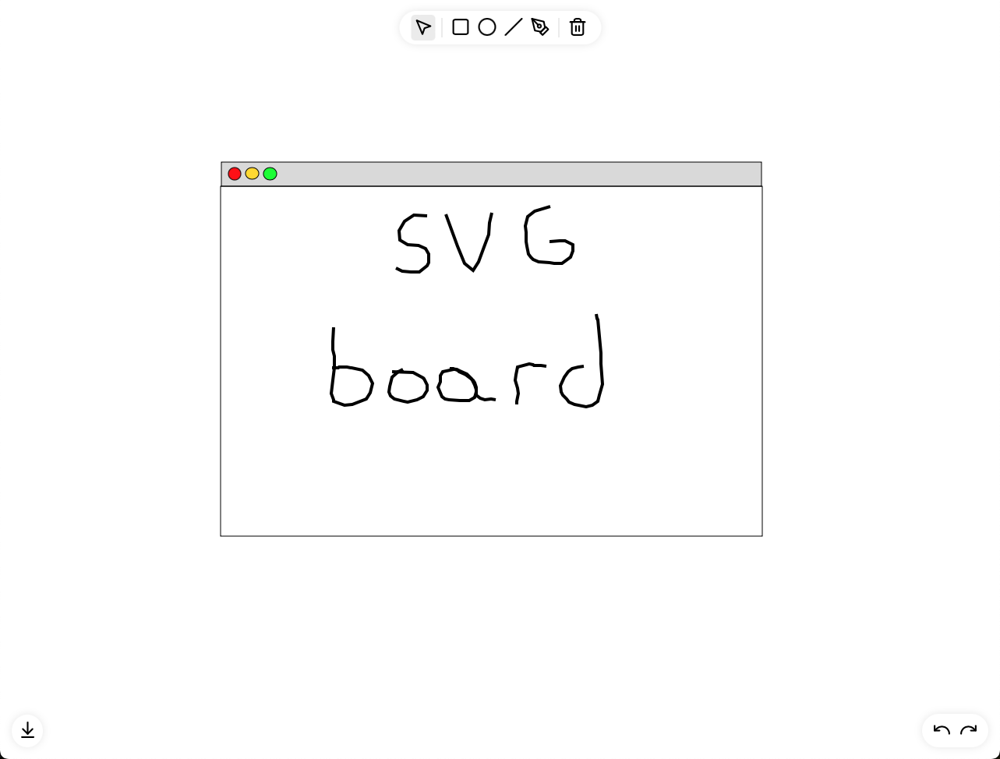

 

    

  <h3 align="center">SVG Board</h3>

  

    Final project for multimedia course
  

## Features

- [x] Draw rectangles, circles, lines
- [x] Change fill and stroke color and width
- [x] Pen tool (freehand drawing) with point editing 
- [x] Select/Multi-select objects and move/modify them
- [x] Undo and redo actions
- [x] Save and load (in local storage) and export to .svg or .png

## Possible improvements
- [ ] Create a clearer selected element indicator
- [ ] Create a text tool
- [ ] Add rotation to move tool
- [ ] Add z-index traversal to move tool
 